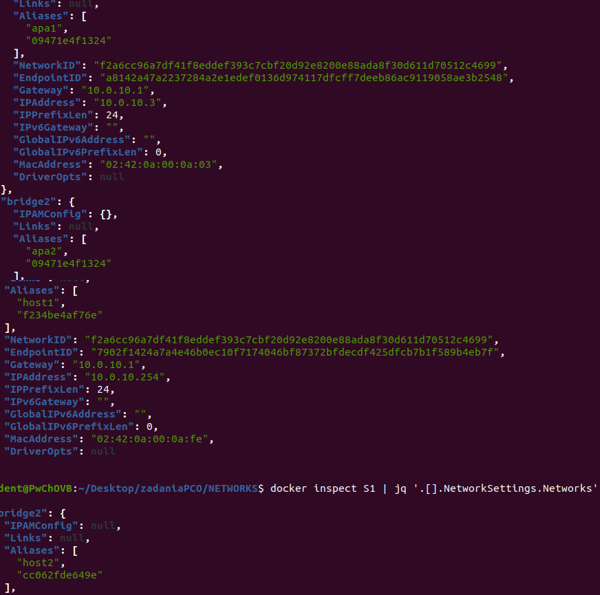

# networks
# Lab7-network
 
Zadanie 5.1
-
skrypt do rozwiązania w 5Z1.sh

Kontener T2 i D2 po uruchomieniu

Zadanie 5.3
-
skrypt do rozwiązania w 5Z3.sh

Aliasy dla kolejno kontenerów D2,D1,S1

Pytanie do zadania:
Czy można używać aliasów do komunikacji pomiędzy kontenerami przyłączonymi do dwóch
różnych sieci ale pracujących w trybie mostu definiowanego przez użytkownika (np. pomiędzy
host1 a host2)? Odpowiedź uzasadnij powołując się na sposób implementacji aliasów o zasięgu
sieci.

Nie można używac aliasów do komunikacji między kontenerami w dwóch różnych sieciach ponieważ mają one zasięg lokalny(Tylko w jednej sieci)
